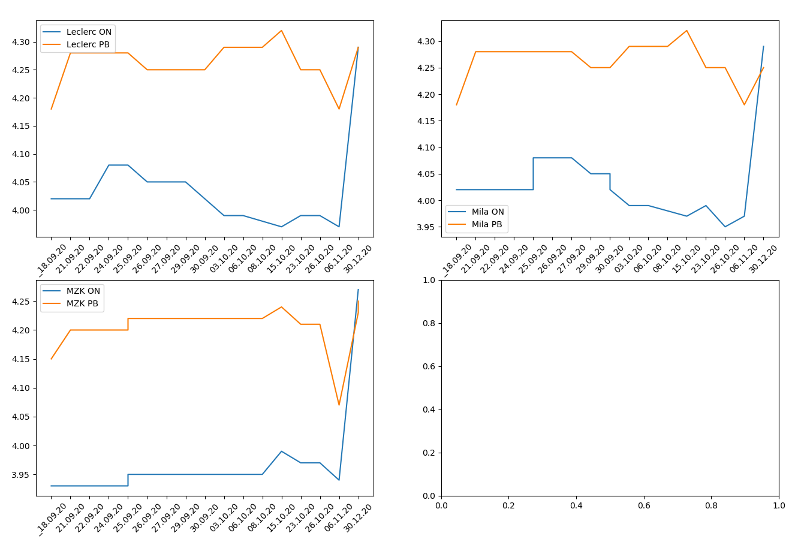
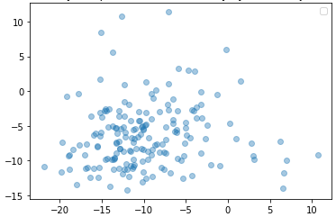
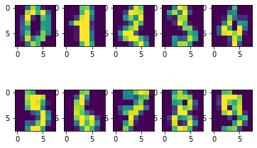

## Python 

 This is some of my python code, feel free to explore it, this repository will be uptaded, also I plan to translate all of the code to english.
 
## What kind of programs are these?

I have wrote all of this code while learning python, my goal is to learn machine learning as I find this particular science field massively interesting.

###Web Scraping Fuel Prices
This program is mainly using **Beatiful Soup 4, csv and matplotlib** modules to gather information from 3 (at the moment) websites, it collects fuel prices both gasoline and diesel, puts them in csv file with their date. With each program start new data is written, existing prices are being displayed on 3 plots, one per petrol station. There are only 3 stations at the moment that I've took in consideration, since only 3 of them in my city are sharing ther prices via websites. 

**Sample chart**

The fourth chart is left blank for purpouse, so I can add there another station. It could be also displayed in 3x1 or 1x3 subplots.

Code is easily scalabe, so there wouldn't be any problems in adding a few stations more. Starting the program can be automated, so that it automaticaly gather daily or weekly fuel prices - it is very likely that I may continue this project.
 
**Obstacles** of course when it comes to web scraping the main obstacle is contstant changing of the websites, so if any of these 3 websites will be modified, thus my code shall be modified too.

###Machine Learning

For now this project is under development, since I am new to the topic. This code displays wariance characteristcs for particular set of data

It also displays digits used in sklearn.datasets digits set used often in ML field.

When I'll find some spare time between academic lectures and my studies I'll be more than sure to upload some of my results in this repository. 

### Please, feel free to send me a message if needed.

